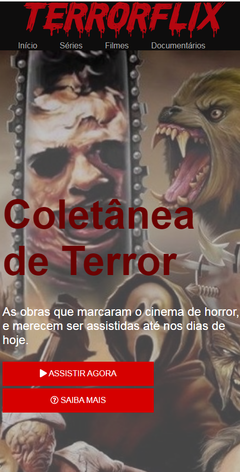

# TERRORFLIX

## Recriando a Interface do Netflix
- Utilizando tecnologias simples como HTML5, CSS3 e JavaScript.
-  Nesse projeto foi aprendido como estruturar um layout, técnicas de CSS3 com containers e variáveis, como posicionar os elementos com Flexbox e como utilizar plugins JQuery

	

  

	

